# SSMISHRA PBX

**Enterprise Multi-Tenant VoIP Platform**

Centralized management plane for Asterisk. Resellers bring their own servers; tenants get full PBX features through a modern web UI.

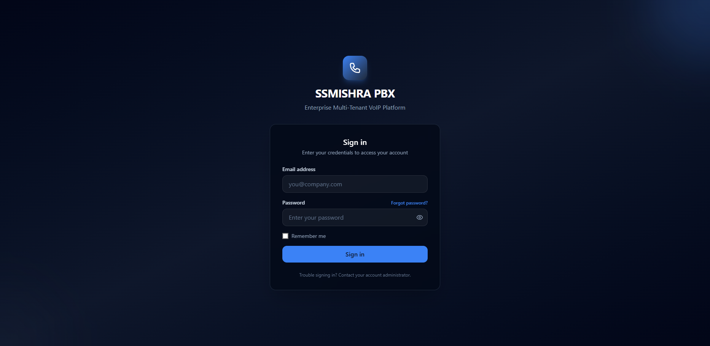

---

## How it works

### Control plane + media plane

- The **web UI and API** are the control plane. All configuration, users, billing, and live monitoring live here.
- **Asterisk servers** (owned by resellers) handle the actual media. SIP, RTP, and call processing stay on those nodes.
- A lightweight **Node Agent** runs on each Asterisk host. It opens an **outbound** secure connection to the platform — no inbound management ports are required on the reseller side.
- Configuration changes made in the UI are stored centrally, then pushed through the agent to Asterisk (PJSIP, dialplan, ARI apps).
- Softphones and desk phones talk **directly** to Asterisk. Media never passes through the platform.

### Roles & hierarchy

| Level | Who | What they manage |
|-------|-----|------------------|
| **Super Admin** | Platform operator | Servers, partners (resellers), plans, global settings, recording storage |
| **Partner / Reseller** | Brings own Asterisk boxes | Their servers, tenants, trunks, partner plans |
| **Tenant Admin** | Customer organization | Extensions, ring groups, IVR, dialplans, time conditions, call records, users |
| **Agents / Users** | End users | Softphone, their own calls, presence |

Every resource is scoped. A tenant never sees another tenant’s data; a reseller never sees another reseller’s servers.

---

## What you can do in the UI

### Dashboard

Live overview of the whole platform: total servers, active tenants, online extensions, active calls, revenue, and server health. Updates in real time.

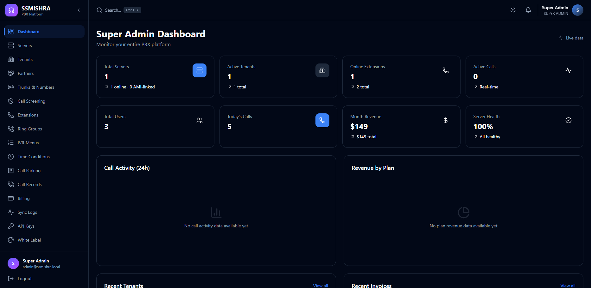

### Servers

Register Asterisk nodes and install the Node Agent.  
Each server shows status (ONLINE), mode (AGENT), host, SIP domain, extension count, tenant count, total CDRs, and last ping.

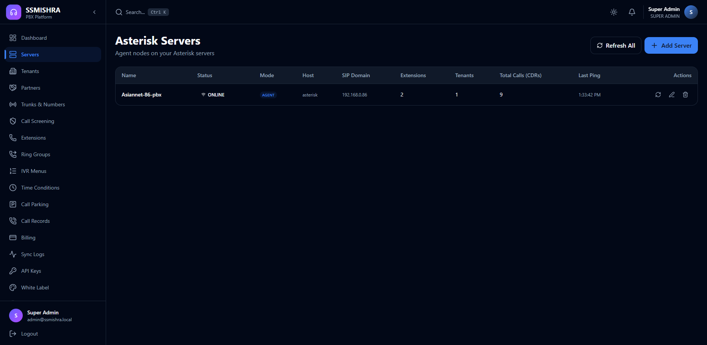

### Partners

Manage reseller partners and assign partner plans.  
Track total partners, active ones, those with a plan, and how many tenants each partner has.

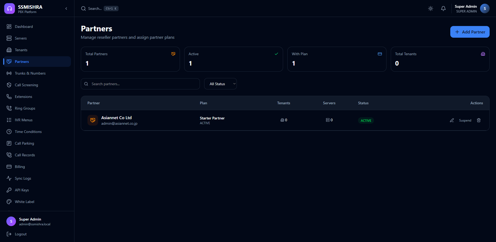

### Tenants

Create and manage customer organizations.  
Each tenant is linked to a server and a plan, and shows users, extensions, call volume, and status.

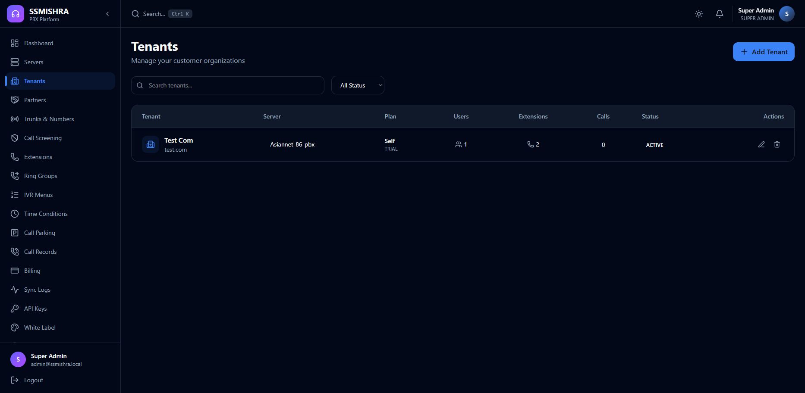

### Trunks & Numbers

SIP trunks and DIDs belong together.  
Add trunks, attach phone numbers, and assign them to servers.

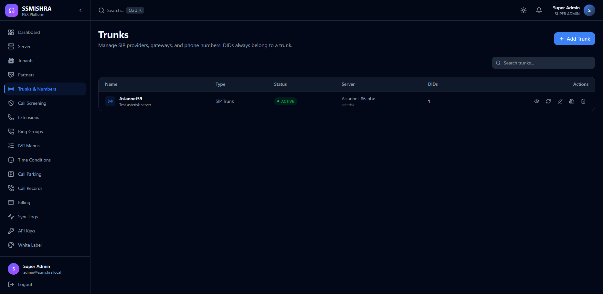

### Call Screening

Per-tenant blacklist and whitelist.  
Block spam or always-allow known numbers with an optional reason.

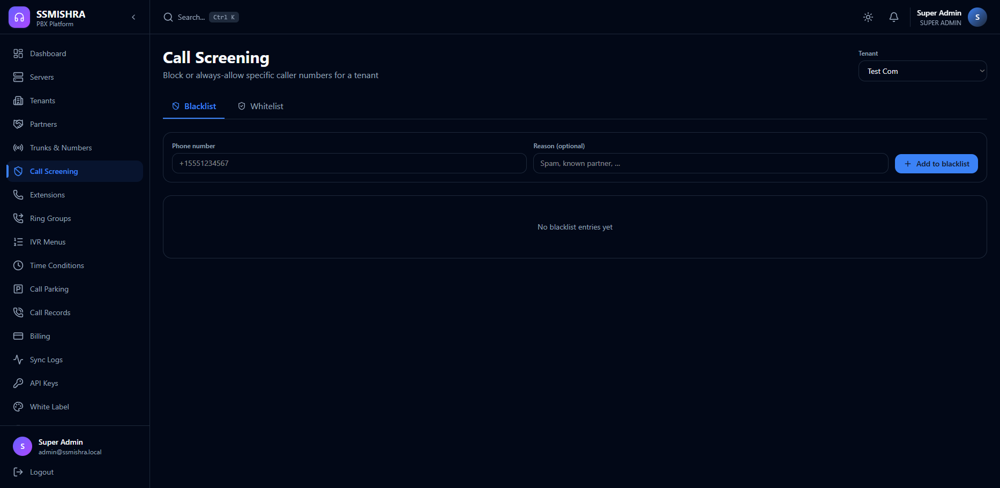

### Extensions

Full SIP extension management.  
See online/offline status, caller ID, context, features (Voicemail, Recording), and sync changes to Asterisk with one click.

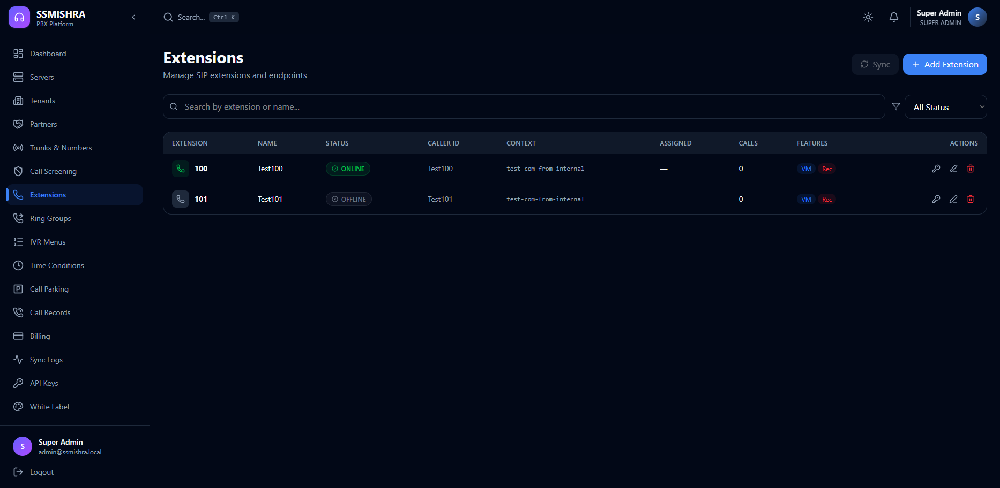

### Ring Groups

Ring multiple extensions at once or in sequence.  
Configure ring strategy and timeout, then manage members from the group cards.

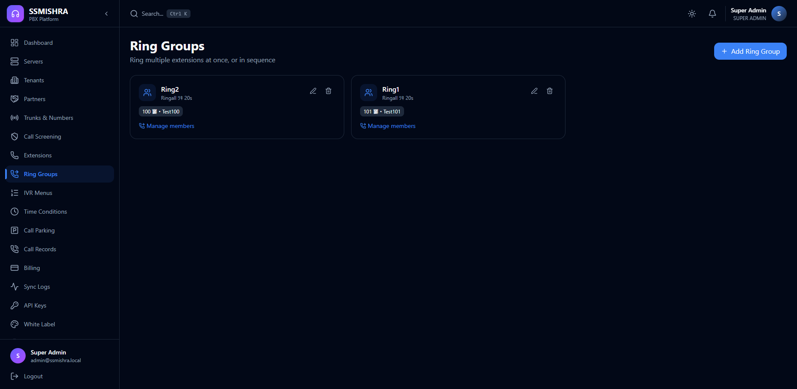

### IVR Menus

Build auto-attendant menus (“Press 1 for Sales, 2 for Support…”).  
Map digits to extensions, queues, or other destinations with timeout handling.

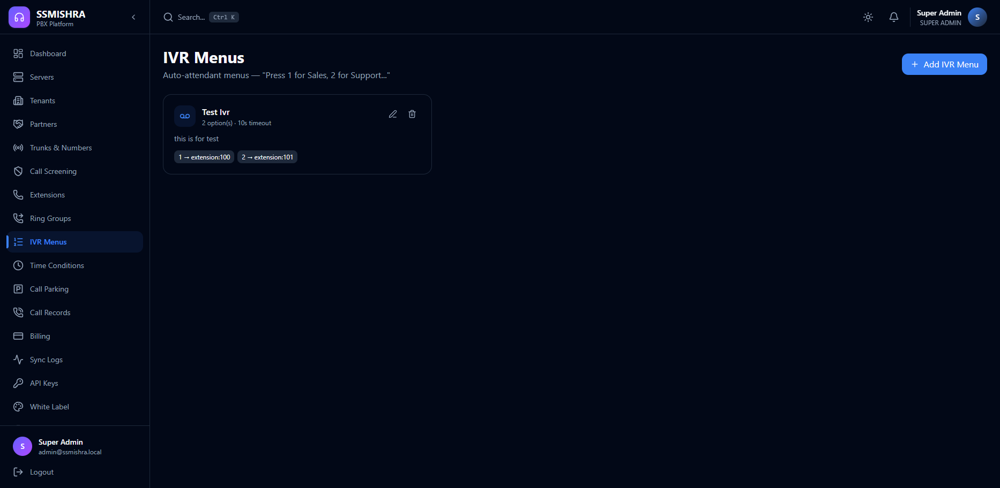

### Time Conditions

Route calls differently based on business hours and holidays.  
Example: Mon–Fri 09:00–17:00 → IVR; outside hours → voicemail.

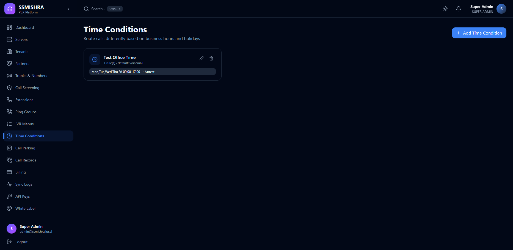

### Call Detail Records

Search, filter, and audit every call.  
Stats for total / answered / missed, average talk time, direction, hangup reason, and playback of recordings or voicemail. Export to CSV.

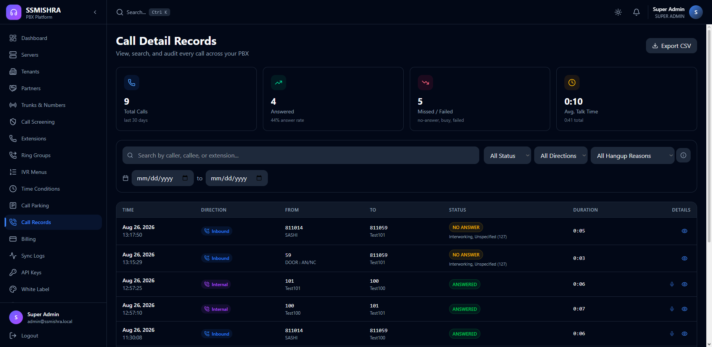

### Billing & Plans

- **Tenant plans** (sold to customers): Self, Starter, Professional, Enterprise — limits on extensions, concurrent calls, recording storage, and feature flags.
- **Partner plans** (sold to resellers): Starter Partner, Professional Partner — limits on tenants, PBX servers, and staff seats.
- Invoices, subscriptions, revenue charts, and plan distribution.

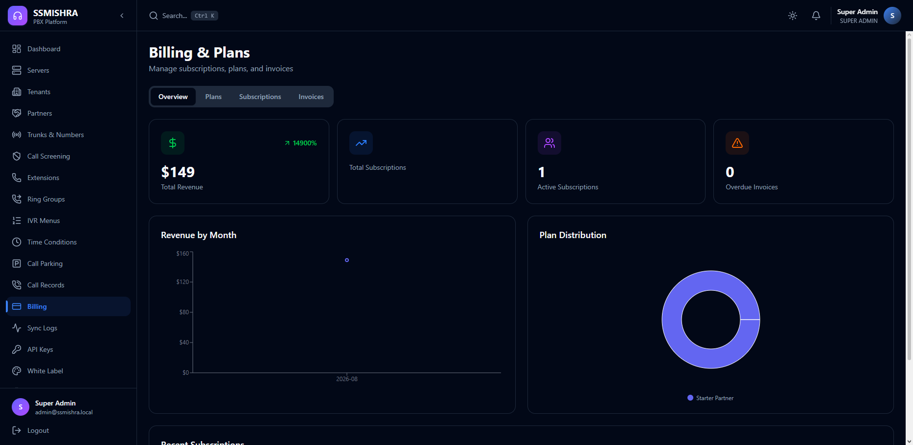

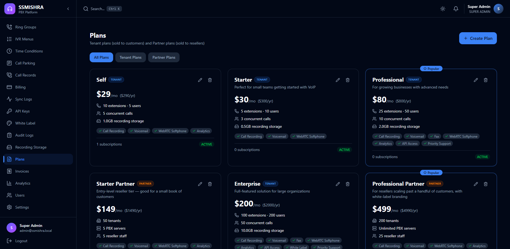

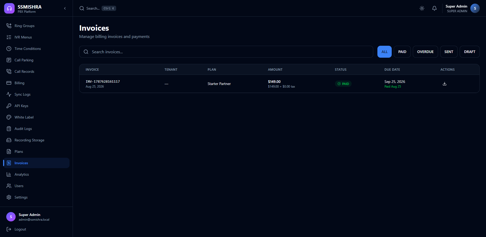

### Recording Storage

Platform-wide choice of where call recordings are archived:

- **Node-local** (default) — stay on the Asterisk box, fetched on demand
- **This server’s local disk** — copied to the control-plane server after each call
- **Amazon S3** or **MinIO** — durable object storage

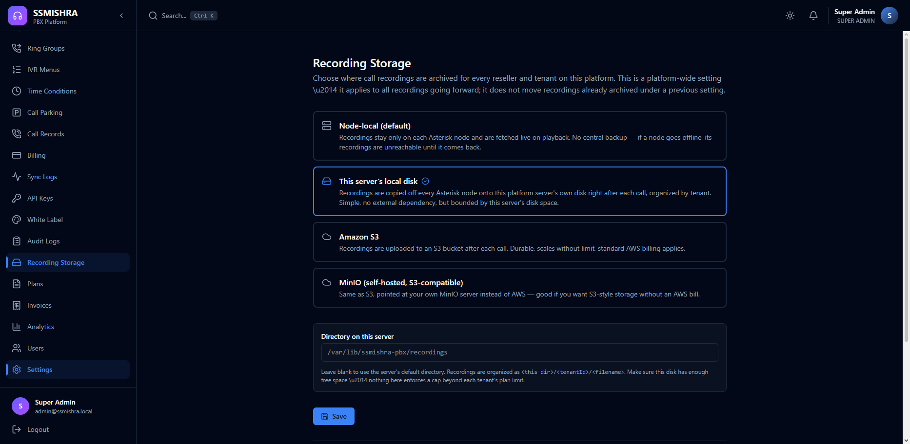

### Users

Manage Super Admins, Resellers, Tenant Admins, and agents.  
Filter by tenant, role, and status. Track last login and assigned extensions.

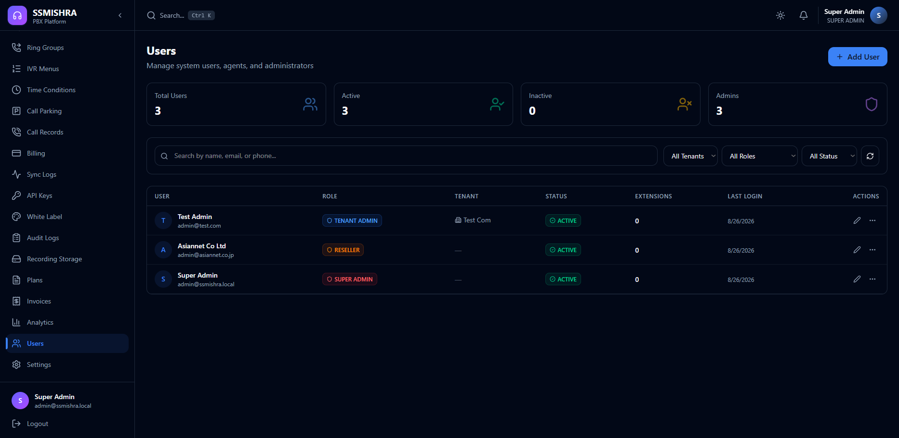

Tenant User with Softphone.

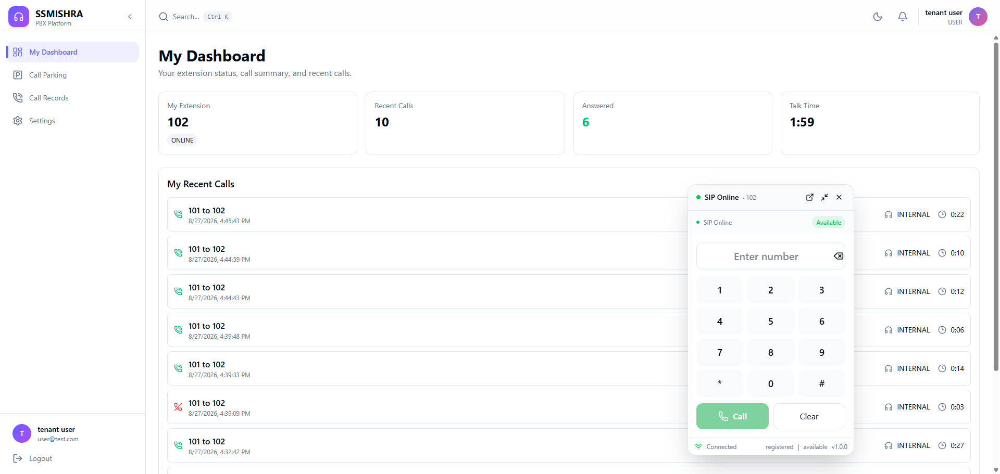


### Dialplan Builder (visual)

Drag-and-drop call-flow designer for inbound and outbound routes.

- Block library: Incoming DID, Trunk, Ring Group, Queue, Extension, IVR, Time Condition, If/Else, Hangup, etc.
- Color-coded ports for Answered / Busy / No Answer / Unavailable / Congestion.
- Validate → Save → Deploy. Versioned releases are pushed to Asterisk through the Node Agent.

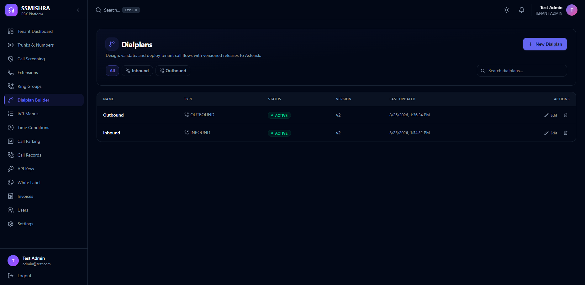

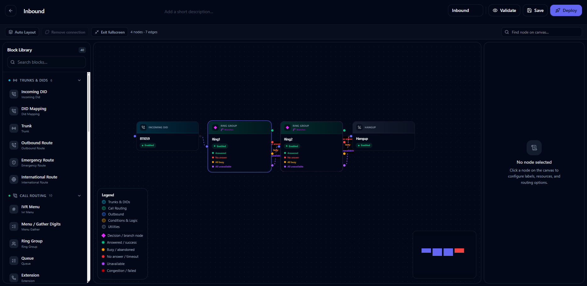

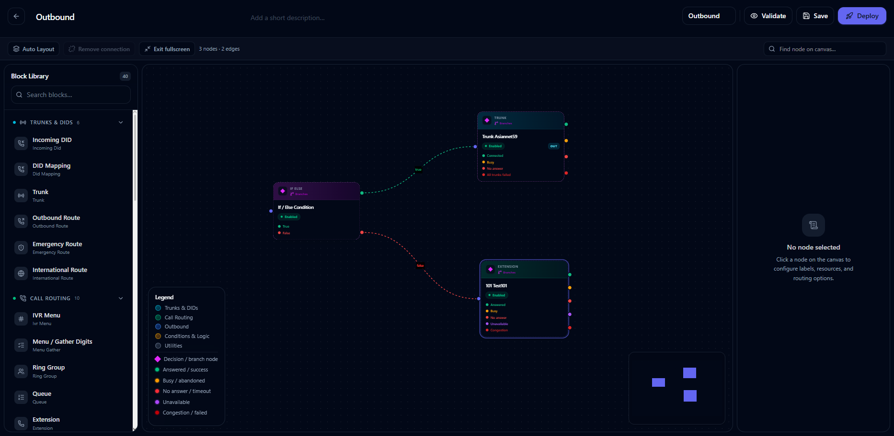

---

## Core principle

The platform is the **management plane**.  
Resellers own and operate the **media plane** (Asterisk).  
Configuration flows down through the Node Agent; SIP and RTP stay local to the reseller’s infrastructure.

---

## Built with

| Layer | Stack |
|-------|--------|
| Frontend | React, Vite, TypeScript, Tailwind CSS, Zustand, TanStack Query, SIP.js |
| Backend | Node.js, Express, TypeScript, Prisma, PostgreSQL, Redis, Socket.IO |
| Agent | Node.js, TypeScript (AMI / ARI) |
| Telephony | Asterisk, PJSIP, ARI, AMI |

---

## Repository

```text
frontend/               React control panel + softphone + visual dialplan builder
backend/                API, auth, provisioning, CDR, billing, WebSocket
agent-node/             Outbound agent that runs on each Asterisk host
ssmishra-pbx-images/    UI screenshots used in this README
docs/                   Design notes
scripts/                Load / smoke tests
```
